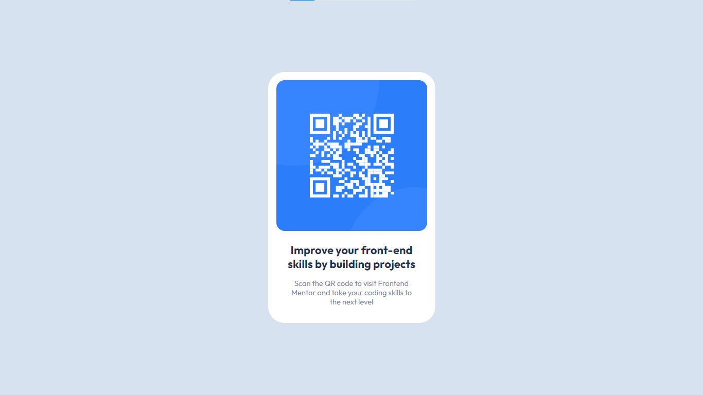

# Frontend Mentor - QR code component solution

This is a solution to the [QR code component challenge on Frontend Mentor](https://www.frontendmentor.io/challenges/qr-code-component-iux_sIO_H). Frontend Mentor challenges help you improve your coding skills by building realistic projects.

## Table of contents

- [Overview](#overview)
  - [Screenshot](#screenshot)
  - [Links](#links)
- [My process](#my-process)
  - [Built with](#built-with)
  - [What I learned](#what-i-learned)
  - [Useful resources](#useful-resources)
- [Author](#author)
- [Acknowledgments](#acknowledgments)

## Overview

### Screenshot

### Links

- Solution URL: [Add solution URL here](https://your-solution-url.com)
- Live Site URL: [Add live site URL here](https://your-live-site-url.com)

## My process

### Built with

- Semantic HTML5 markup
- CSS custom properties
- Flexbox
- CSS Grid
- Mobile-first workflow
- CSS Reset

### What I learned

This project majorly helped me understand the workflow and typing organized and clean code. I learnt why and how CSS Custom Properties and help save a lot of time and keep our code organized. I learnt why a CSS Reset is super Beneficial. I learnt how to use classes in a more efficient manner

### Useful resources

- [CSS Reset Code](https://www.joshwcomeau.com/css/custom-css-reset/) - This is a link to a chunk of CSS Reset Code that was really helpful to get started with my CSS.
- [FrontEnd Mentor Project Tutorial by Kevin Powell](https://www.youtube.com/watch?v=B2WL6KkqhLQ) - This video by Kevin Powell helped me understand how to go about building a project from scratch.

## Author

- Frontend Mentor - [@vaguepizza](https://www.frontendmentor.io/profile/vaguepizza)
- Twitter - [@pizzacubess](https://www.twitter.com/pizzacubess)

## Acknowledgments

I want to give a special shoutout to Kevin Powell's YouTube channel for being an invaluable resource throughout this project. His clear explanations and tutorials helped me grasp key concepts that were crucial to its success. Thanks, Kevin, for your expertise and guidance!
